# 🏢 Academic Data Center (UniversityDataPlatform)

Academic Data Center is a state-of-the-art web-based platform that stores, standardizes, and manages research datasets from various university faculties. Leveraging a **.NET 10.0 Blazor Server** architecture integrated with an autonomous **Python AutoML engine**, the platform delivers real-time statistical analysis and machine learning models for researchers.

---

## 📸 Screenshots and Visuals

### 1. Secure Authentication Panel
The welcoming gateway with secure administrator verification and convenient guest access options.
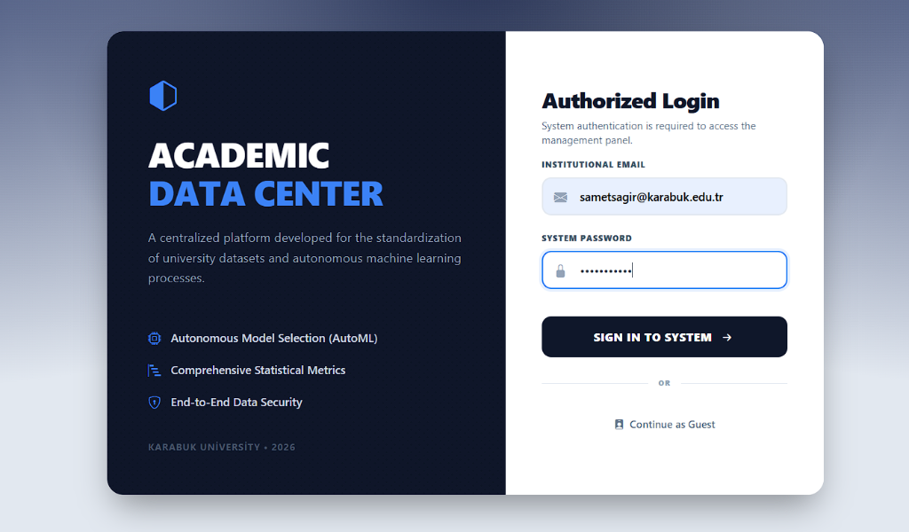

### 2. Management and Faculty Dashboard
Centralized dashboard showing all academic units, data volume, and total trained models.
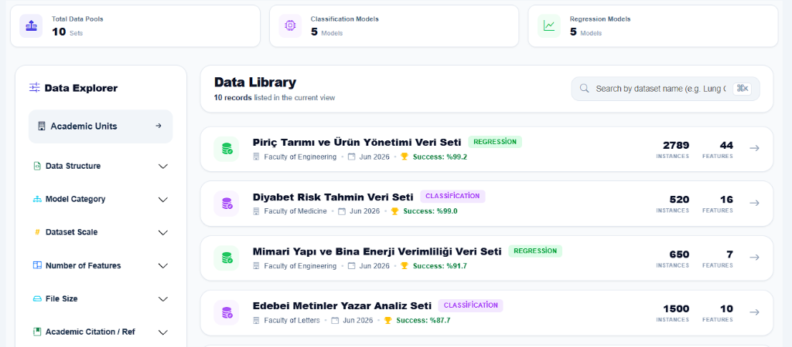

### 3. Dataset Upload & Configuration Form
Streamlined publishing pipeline assigned to specific academic units with drop-zone upload support.
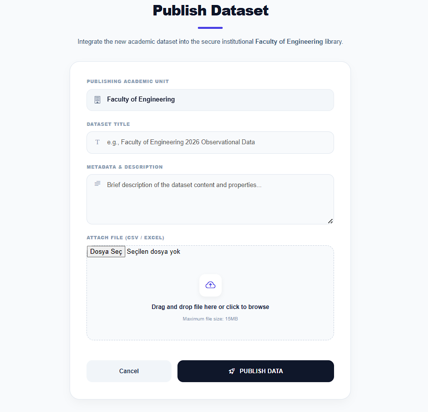

### 4. Comprehensive Dataset Analytics
Deep inspection panel displaying general metadata and AutoML target configuration tools.
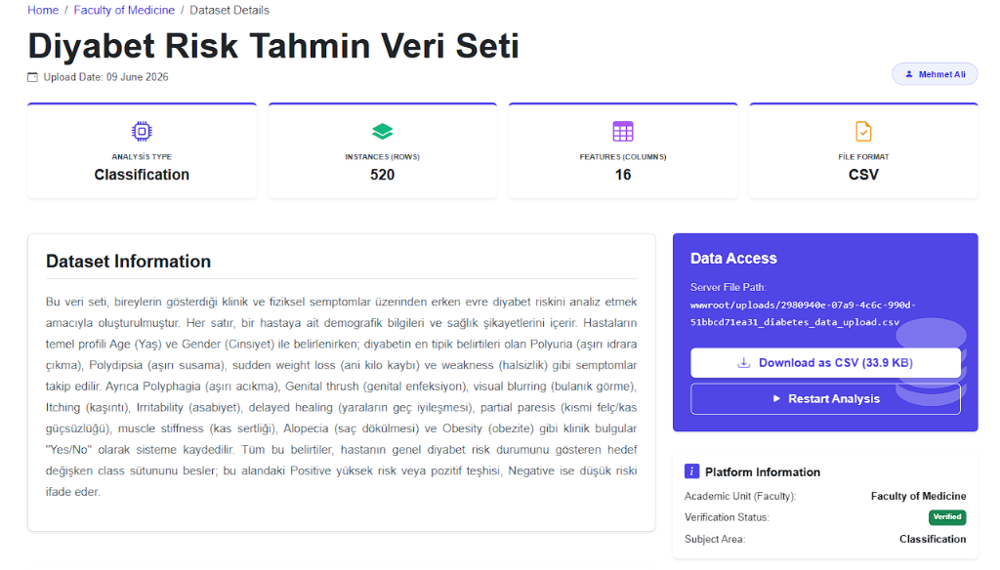

### 5. Variable Properties (Metadata) Table
Automatically parsed variable metadata, showing data types, model roles, and missing values.
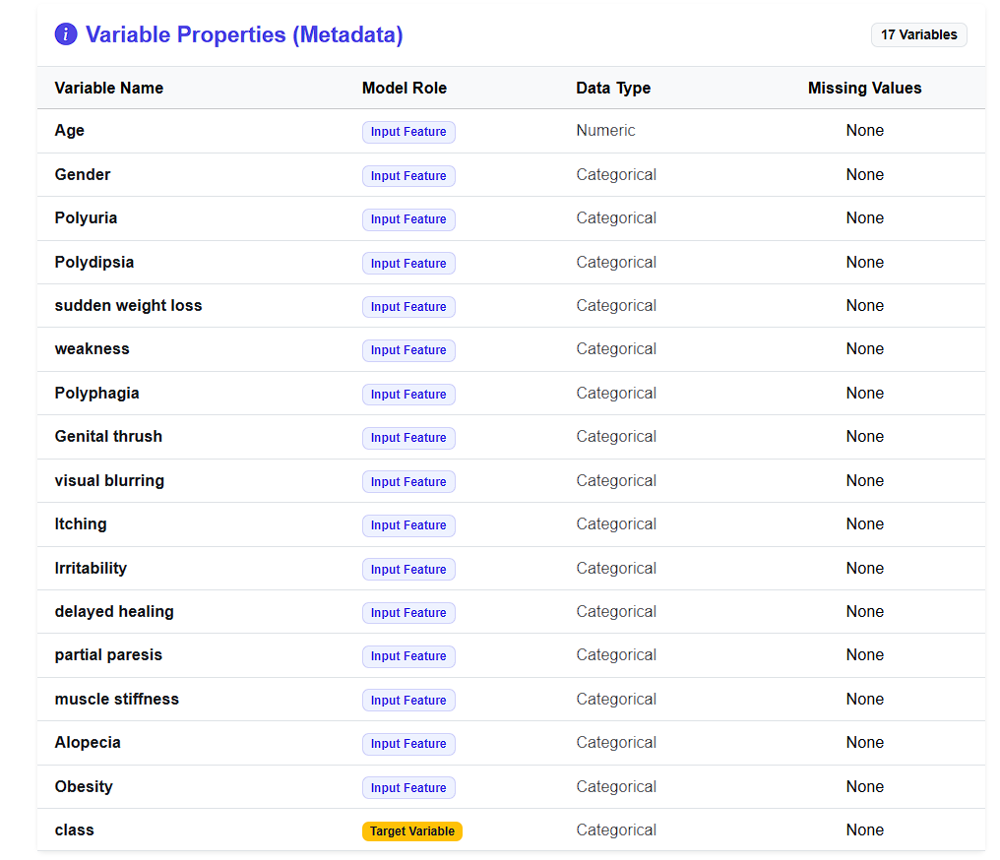

### 6. Academic References & AutoML Leaderboard
Dynamic bibliography list paired with an AutoML model performance leaderboard (Random Forest, Decision Tree, etc.).
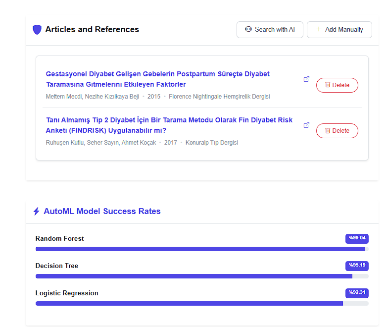

### 7. AutoML Model Performance
Visual model leaderboard highlighting accuracy scores.
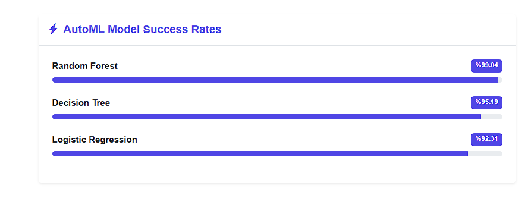

### 8. Feature Importance Analysis
Horizontal bar chart depicting feature weights from the trained AutoML models.
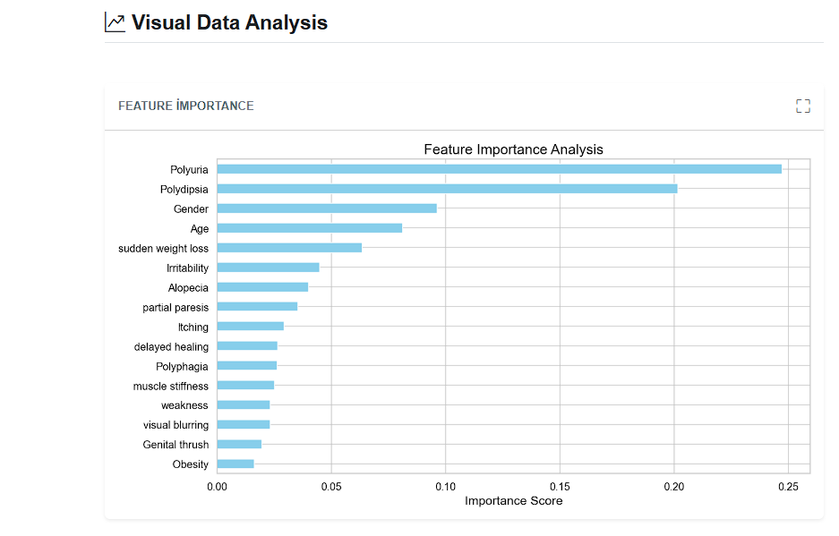

### 9. Confusion Matrix Heatmap
Visual prediction accuracy matrix for classification tasks.
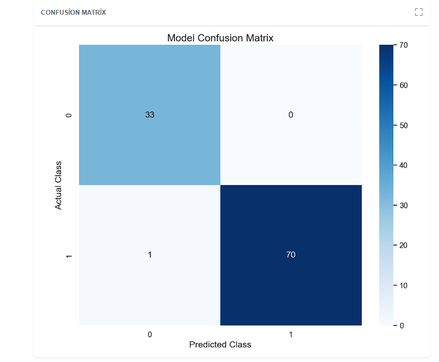

### 10. Target Variable Distribution
Pie chart displaying proportion statistics of target variable classes.
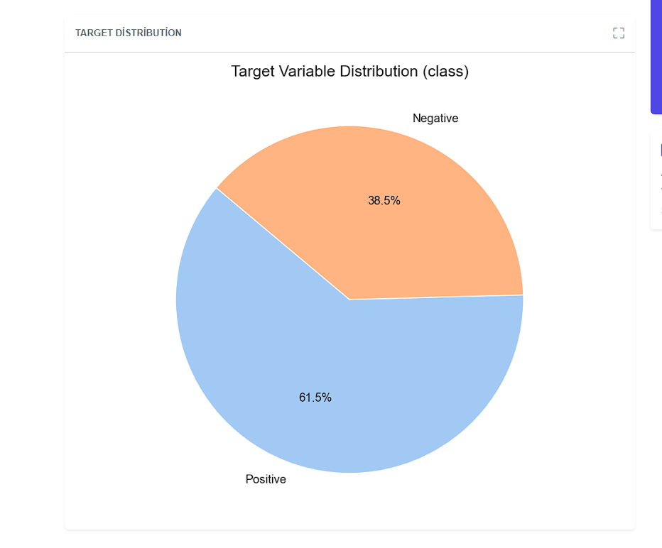

---

## 🛠️ Technology Stack

*   **Web Architecture:** .NET 10.0 / Blazor Server (Real-time component-based UI)
*   **Database & ORM:** SQL Server with Entity Framework Core (Code-First migrations)
*   **AutoML Backend:** Python 3.x with Scikit-Learn (Random Forest, Decision Tree, Logistic/Ridge Regression)
*   **Data Processing:** Pandas, NumPy, and Openpyxl
*   **Data Visualization:** Matplotlib and Seaborn (Dynamic Base64 rendering)
*   **Security:** ASP.NET Core Identity PBKDF2 Password Hashing & Custom Authorization Providers

---

## 📐 Architecture
The system coordinates asynchronous subprocess execution to run Python scripts safely:
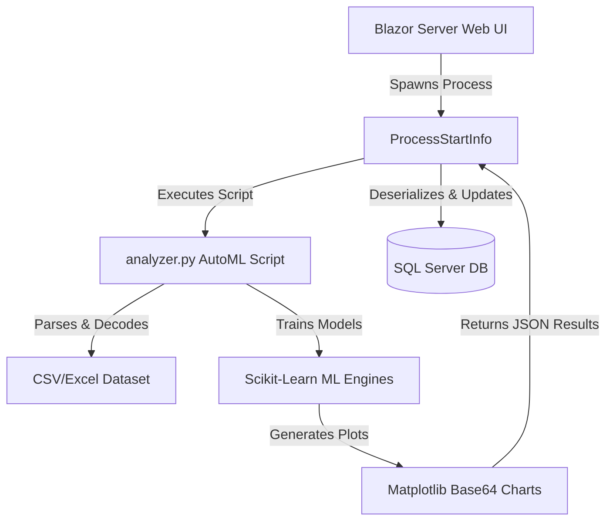

---

## 📁 Project Structure

```text
UniversityDataPlatform/
│
├── Components/                 # Blazor UI Pages & Common Layouts
│   ├── Layout/                 # Shared Layouts (MainLayout, NavMenu)
│   └── Pages/                  # App Views (Home, Login, Upload, Details)
│
├── Data/                       # DbContext, Migrations & Db Initializer
│
├── Models/                     # EF Core Entity Models (User, Dataset, Faculty, etc.)
│
├── Repositories/               # Data Access Layers (Repository Pattern)
│
├── Services/                   # Authentication & External Search Services
│
├── wwwroot/                    # CSS, JS, and Static Assets
│   └── scripts/                # Background Python Analysis Engines (analyzer.py)
│
├── docs/                       # Project Documentation Assets
│   └── images/                 # App Screenshots for README
│
├── generate_datasets.py        # Python sample data generator script
├── .env                        # Local environment settings (Git-ignored)
└── .gitignore                  # Git exclusion rules
```

---

## 🚀 Installation & Setup

### 1. Prerequisites
Ensure you have the following installed on your machine:
*   .NET 10.0 SDK
*   SQL Server (LocalDB or full instance)
*   Python 3.x

### 2. Python Packages
Install the required data science and machine learning libraries:
```bash
pip install pandas numpy scikit-learn matplotlib seaborn openpyxl
```

### 3. Local Environment Setup
Create a copy of `.env.example` named `.env` in the root directory and update the connection string with your database server details:
```env
DB_CONNECTION_STRING=Server=YOUR_SERVER_NAME;Database=UniversityDataDb;Trusted_Connection=True;MultipleActiveResultSets=true;TrustServerCertificate=True
```

### 4. Populate Sample Datasets
Generate 10 domain-specific CSV files under `sample_datasets/` by running:
```bash
python generate_datasets.py
```

### 5. Run Database Migrations
Apply database schema changes and seed initial academic units and users:
```bash
cd UniversityDataPlatform
dotnet ef database update
```
*(Use the administrator credentials defined during database seeding/setup to login.)*

### 6. Launch the Platform
Start the Blazor application:
```bash
dotnet run
```
Access the application at `https://localhost:7198` or `http://localhost:5236`.

---

## 📊 Outputs & Visualizations
Upon successful AutoML runs, the analyzer produces:
*   **Performance Metrics:** Detailed leaderboards comparing model scores.
*   **Feature Importance Chart:** Horizontal bar chart analyzing feature weights.
*   **Confusion Matrix:** Heatmap demonstrating class-wise prediction metrics.
*   **Residuals Plot:** Histogram analyzing prediction errors for regression tasks.

---

## 🛡️ Error Handling
*   **Data Imputation:** Automatically handles missing values via row deletion before training.
*   **Format Verification:** Rejects non-CSV/Excel file selections in the frontend upload dialog.
*   **Fail-Safe Target:** Automatically defaults to the last column if target parameters mismatch.

---

## 🔮 Future Improvements
*   **Deep Learning Models:** Integrated PyTorch/TensorFlow support for Multi-Layer Perceptron (MLP) neural network architectures.
*   **Auto-Tuning:** Automatic hyperparameter tuning utilizing the `Optuna` optimization library.
*   **Advanced Preprocessing:** Outlier detection and SMOTE balancing tools selectable from the user interface.
*   **PDF Academic Reports:** One-click academic-format PDF exports containing full analytical insights.

---
## 📄 License
This project is licensed under the [MIT License](LICENSE).

---
## 👥 Author
*   **Author:** samet sagir
